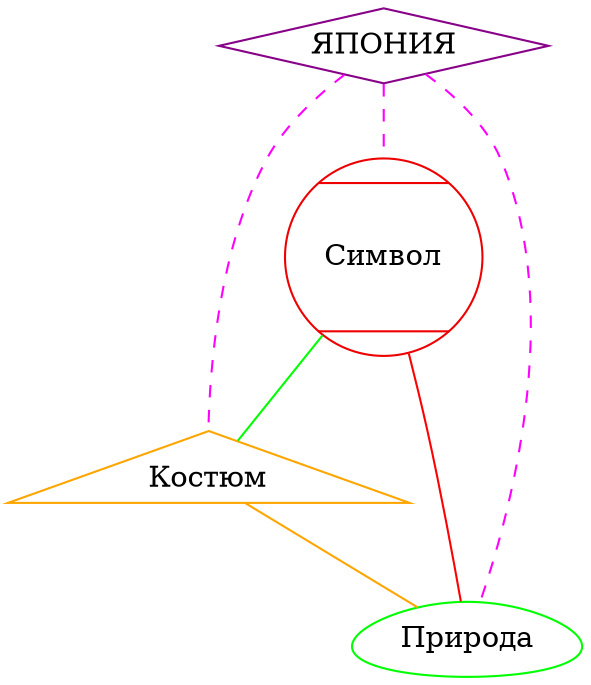
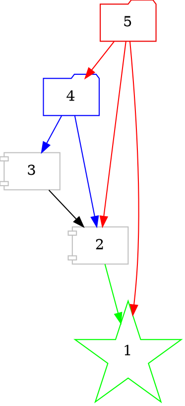
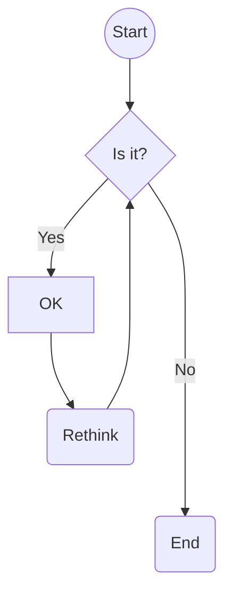
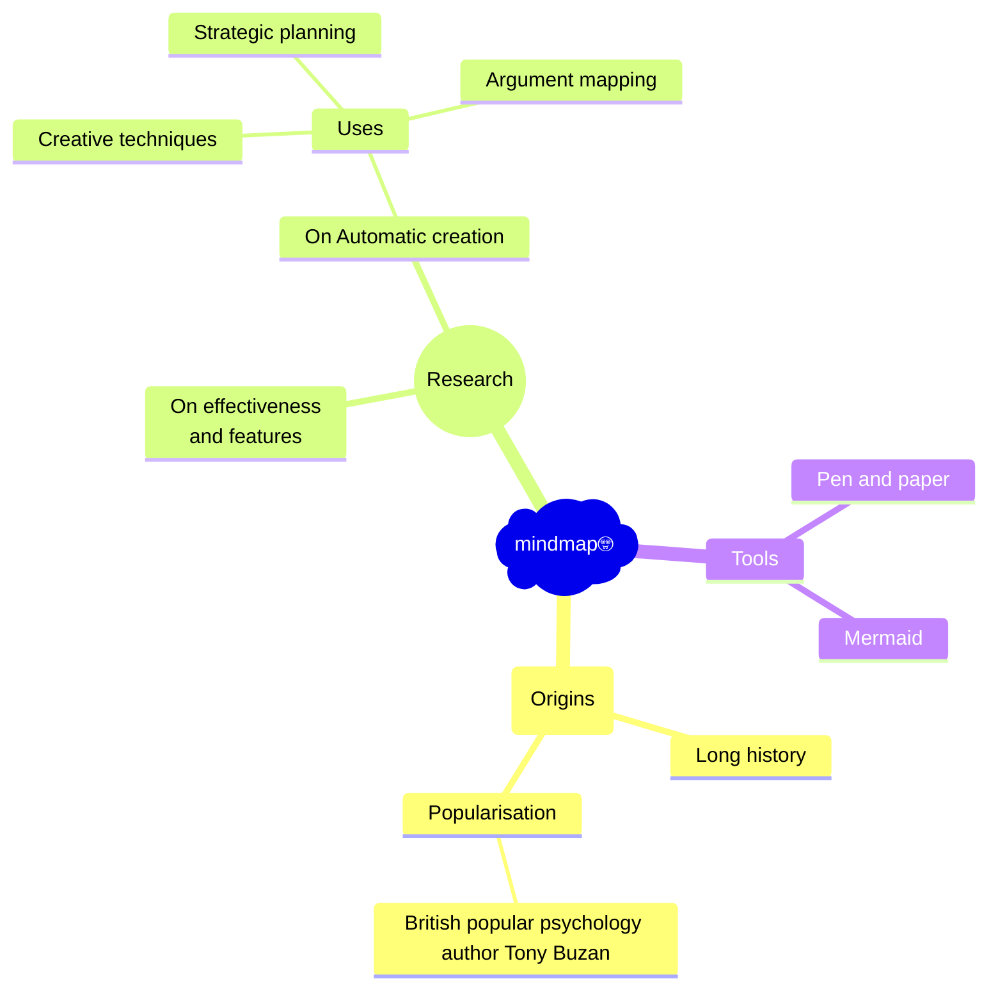

# ProgrammingCollege
Demo and control programs for education and for science work

## Hello C/C++ World!
1. Task. Write C program that print Your First and Second name by using only putchar() commands!

2. Task. Using conditions of Task1 write Your name and Second name 10 times.

3. Task.  Using conditions of Task1 write Your name and Second name 1000000 times.
 
4. Task. As a programmer, I set restrictions on writing program code in C - one command per line!
  Write the shortest program in C that prints the string Hello! 1000000 times to the console. 
  In this case, you can only print characters to the console using the putchar() command.
  It is forbidden to use any variables, cycles, conditional statements, and the goto statement, as well as macros and other files!

## Formulas examples
$$
 y=x^2
$$

# 2026.02.02 Программування. Загальні питання
[TOC]

---
 
# [Мова MarkDown для колаборативної праці]()

---

## Активні коментарі в документі

--- 

  Наскільки Ви згодні, що активні коментарі в hackmd документах є важливим засобом оперативної комунікації на  online заняттях?
  

---
  
## Приклади посилань 

 Тест швидкості інтернет-з'єднання - посилання формату md
[2ip.ua with Internet speed test](https://2ip.ua/ru/myspeed) 

Тест швидкості інтернет-з'єднання - посилання формату html
<a href=https://2ip.ua/ru/myspeed>tag a link to 2ip.ua with Internet speed test</a>

---

## Фрейми

---

### iframe з табличками Google 
<iframe src="https://docs.google.com/spreadsheets/d/1yiw4nB2waxE6ITodUhmIZLaUHQu2hDSheltrjUKnxz0/edit?usp=sharing" style="border: 1" width="2048" height="800" frameborder="0" scrolling="no"></iframe>

---

### iframe to onecompiler хостинг
<iframe src="https://onecompiler.com/cpp/44ce4dz2u" style="border: 0" width="2048" height="800" frameborder="0" scrolling="no"></iframe>

---

## TeX formulas 

--- 

### Simple inline 

Text with formulas $i \le 21$ and another formula $y=x^2$.

---

### Simple outline

$$ i \le 21 $$
 
$$ y=x^2 $$

---

### Simple outline with Integral
$$
y = \int
        _{-\pi}
        ^{\pi} 
         \sin(\cos x) \, 
    dx 
$$


---

### Simple outline matrix
$$
  \begin{bmatrix}
        -e     & \varphi   \\
        \sin x &  \cos x 
  \end{bmatrix}
$$

---

### Outline array matrix with TeX square brackets
$$
 \left[
  \begin{array} {ccc|c}
   1 & 2 & 3 & 4 \\
   1 & 2 & 3 & 4 \\
   1 & 2 & 3 & 4 \\
   \hline
   1 & 2 & 3 & 4
  \end{array}
\right]
$$

---

### [Vega vizualization](https://vega.github.io/vega/examples/)

---

```vega
{
"$schema": "https://vega.github.io/schema/vega-lite/v4.json",
"description": "A simple bar chart with embedded data.",
"height": "250", "width": "500",
"data": {
   "values": [
      {"a": "Alice", "b": 28}, {"a": "Bob", "b": 55}, {"a": "Cat", "b": 43},
      {"a": "Denis", "b": 91}, {"a": "Eve", "b": 81}, {"a": "Fank", "b": 53},
      {"a": "G", "b": 19}, {"a": "H", "b": 87}, {"a": "I", "b": 52}
   ]
},
"mark": "bar",
"encoding": {
   "x": {"field": "a", "type": "ordinal"},
   "y": {"field": "b", "type": "quantitative"}
   }
}
```

---

### Picture on i.imgur.com  

---


---


---


---

## [Таблиці]()

---

### Simple Table

| Column 1 | Column 2 | Column 3 |
| -------- | -------- | -------- |
| Text1    | Text2    | Text3    |


---

### csvpreview as Table

---

```csvpreview {header="true"}
firstName,last Name,email,phone Number
John,Doe,john@doe.com,0123456789, some another data
Jane,Doe,jane@doe.com,9876543210
some, strange, data
James,Bond,james.bond@mi6.co.uk,0612345678
```

---

## Кодування та малювання графів 

---

### [graphviz Диаграмми](https://graphviz.org/doc/info/shapes.html)

---

#### Диаграмма неорієнтованого графа 

---



---

#### Диаграмма орієнтованого графа 

---



---

## hackmd Блок-схемы та майнд-карти

---

### hackmd Блок-схема (flowchart)

---

```flow
st=>start: Start:>http://flowchart.js.org[blank]
e=>end: MyEnd:>https://hackmd.io/@ArthMax/Code/edit

i=>inputoutput: input something...
op1=>operation: My Operation
sub1=>subroutine: My Subroutine
cond=>condition: Yes or No?:>http://www.google.com
io=>inputoutput: output something...
para=>parallel: parallel tasks

st->i->op1->cond
            cond(yes)->io->e
            cond(no)->para
                      para(path1, bottom)->sub1(bottom)->e
                      para(path2, top)->op1
```


---

### [markmap майнд-карта](https://markmap.js.org/)

---

```markmap
# markmap
## Links
- [markmap.js](https://markmap.js.org/)
- [GitHub](https://github.com/gera2ld/markmap)
## Related
- [coc-markmap](https://github.com/gera2ld/coc-markmap)
- [gatsby-remark-markmap](https://github.com/gera2ld/gatsby-remark-markmap)
## Features
### ordinary Features
- links
- **bold** ~~deleted~~ ++uderlined++ *italic* styles

### Super Features
- `inline monocode`
- multiline and more
  - xxx
  - yyy  
    bbb
```

---


## [mermaid диаграмм](https://mermaid.js.org/)

--- 

### [mermaid Блок-схема](https://mermaid.js.org/syntax/flowchart.html)

---



--- 

### [mermaid mindmap](https://mermaid.js.org/syntax/mindmap.html#icons)

---



---

## [Приклад оформлення кода з відступами](#Приклад-оформлення-кода-з-відступами)

---

```glsl=1
#ifdef GL_ES
precision mediump float;
#endif

uniform float u_time;

    float mytime(float x){
                return x/10.0;
    }
    
void main() {
         float t = mytime(u_time);
          if(t>60.0){
             t=60.0;
          }
           gl_FragColor = vec4(mod(t,1.0), 0.5, 0.0, 1.0);
}
```

---

## [Посилання на правила форматування коду](https://hackmd.io/@ArthMax/Code/edit) 

---


---
